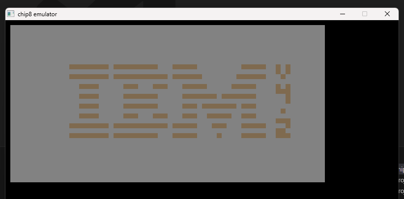
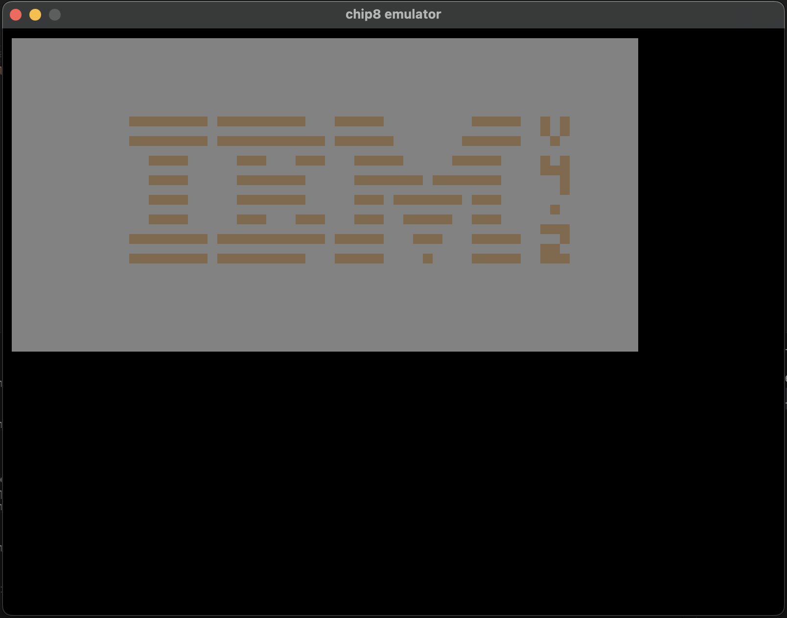

## CHIP-8 Interpreter
Chip-8 is a lightweight virtual machine, which can execute chip8 binaries. It has 34 instructions, 16-level stack and a memory of 4 kb. you can find other details in the reference section.

## screenshot

### References
- [A simple emulation project: chip8](https://multigesture.net/wp-content/uploads/mirror/goldroad/chip8.shtml)

- [how to write a interpreter](https://multigesture.net/articles/how-to-write-an-emulator-chip-8-interpreter/)

- [chip8 techical reference](http://devernay.free.fr/hacks/chip8/C8TECH10.HTM)

- [some test suites](https://github.com/Timendus/chip8-test-suite)

## operations

- use gdb for windows in MIMode
- use lldb for macos in MIMode

## --- core operations ---
- window initialization - done
- audio initializaiton - done
- instruction & operation - done
- does all instructions working as expected -  need to check
- display update - done
- audio update - done

- key inputs - need to check

- test on mac - working
- test on windows - working
- test on linux - not working

- error handling - yet to do
- unit testing - yet to do

- road-map
- follow up in android and iOS using flutter
- in web using java script
